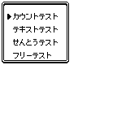
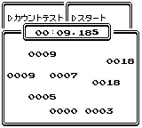

本プログラムは、プレイヤーのボタン入力の速度を測定するツールです。4つの異なるモードで、ボタン入力のテストを実行できます。

## プログラム概要

- メニュー画面でBボタンを押すことで、プログラムを終了できます。

## 各測定モードの詳細

### カウントテスト

| 項目             | 説明                                                                                                                                           |
| :--------------- | :--------------------------------------------------------------------------------------------------------------------------------------------- |
| 測定内容         | 約10秒間のボタン押下回数を測定します。                                                                                                         |
| 遅延フレーム設定 | 「ちえん」から遅延フレーム数を変更できます。これはボタンを押せないフレーム数を指定するものです。                                               |
| 遅延フレーム値   | 0に設定すると遅延が全くない最大の速さになります。指定した数マイナス1で設定されます（例: 1を指定した場合、0として扱われます）。最大値は98です。 |

### テキストテスト

| 項目             | 説明                                                                                                                                                                        |
| :--------------- | :-------------------------------------------------------------------------------------------------------------------------------------------------------------------------- |
| 測定内容         | テキストを全て送るまでに要した時間を秒単位で測定します。                                                                                                                    |
| 選択肢1          | 「だいすきクラブ」を選択すると、ポケモンだいすきクラブ会長のテキストが表示されます。途中で選択肢が表示された場合でも、必ず「はい」を選択したことになります。                |
| 選択肢2          | 「アアアアア」を選択すると、「ア」の行を60行表示します。                                                                                                                    |

### せんとうテスト

| 項目     | 説明                   |
| :------- | :--------------------- |
| 測定内容 | 戦闘時間を測定します。 |

### フリーテスト

| 項目             | 説明                                                                       |
| :--------------- | :------------------------------------------------------------------------- |
| 測定内容         | 時間制限のないカウントテストです。ボタンを押すたびにカウントが増加します。 |
| 終了方法         | STARTボタンとSELECTボタンを同時に押すと測定が終了します。                  |
| 用途             | 時間制限がないため、ボタンの挙動チェックなどにご利用いただけます。         |
| 遅延フレーム設定 | 遅延フレームの仕様は「カウントテスト」と同様です。                         |

## 補足説明

- 測定結果の小数点第一位は6進数（0から5で表現）されておりますので、ご注意ください。
