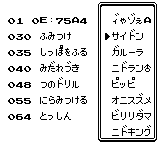

  
<blockquote class="twitter-tweet">
というわけで取得わざを表示するツールを作りました 習得するレベルと技名を順番に表示できます 突貫工事ですが多分ちゃんと動いてます <a href="https://t.co/GTrraUVhk7">pic.twitter.com/GTrraUVhk7</a>
&mdash; ア▶︎イス (@i_c_e_i_c_e_) <a href="https://twitter.com/i_c_e_i_c_e_/status/1664954634203729921?ref_src=twsrc%5Etfw">June 3, 2023</a></blockquote> 

## 機能概要
本ツールを実行すると、内部番号順にポケモンの一覧が表示されます。表示されているポケモンにカーソルを合わせることで、以下の情報が画面に表示されます。

*   ポケモンの内部番号
*   習得技テーブルのアドレス
*   習得技の一覧

バグポケモンについても対応しており、それらの習得技も確認可能です。1ページにつき最大7つの習得技が表示され、Aボタンを押すことで次のページへ移動し、7つ以上の技がある場合も全て確認できます。

## 操作方法
プログラムの操作方法は以下の通りです。

| 操作 | 機能 |
| :--- | :--- |
| ↑    | カーソルを上に移動します |
| ↓    | カーソルを下に移動します |
| ←    | カーソルを8つ上に移動します |
| →    | カーソルを8つ下に移動します |
| A    | ページの移動（次の7つの習得技を表示） |
| B    | プログラムを終了します |

## 注意事項
画面が激しく点滅することがございますので、ご使用の際はご注意ください。