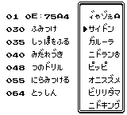

  
<iframe id="twitter-widget-0" scrolling="no" frameborder="0" allowtransparency="true" allowfullscreen="true" class="" title="X Post" src="https://platform.twitter.com/embed/Tweet.html?dnt=false&amp;embedId=twitter-widget-0&amp;features=eyJ0ZndfdGltZWxpbmVfbGlzdCI6eyJidWNrZXQiOltdLCJ2ZXJzaW9uIjpudWxsfSwidGZ3X2ZvbGxvd2VyX2NvdW50X3N1bnNldCI6eyJidWNrZXQiOnRydWUsInZlcnNpb24iOm51bGx9LCJ0ZndfdHdlZXRfZWRpdF9iYWNrZW5kIjp7ImJ1Y2tldCI6Im9uIiwidmVyc2lvbiI6bnVsbH0sInRmd19yZWZzcmNfc2Vzc2lvbiI6eyJidWNrZXQiOiJvbiIsInZlcnNpb24iOm51bGx9LCJ0ZndfZm9zbnJfc29mdF9pbnRlcnZlbnRpb25zX2VuYWJsZWQiOnsiYnVja2V0Ijoib24iLCJ2ZXJzaW9uIjpudWxsfSwidGZ3X21peGVkX21lZGlhXzE1ODk3Ijp7ImJ1Y2tldCI6InRyZWF0bWVudCIsInZlcnNpb24iOm51bGx9LCJ0ZndfZXhwZXJpbWVudHNfY29va2llX2V4cGlyYXRpb24iOnsiYnVja2V0IjoxMjA5NjAwLCJ2ZXJzaW9uIjpudWxsfSwidGZ3X3Nob3dfYmlyZHdhdGNoX3Bpdm90c19lbmFibGVkIjp7ImJ1Y2tldCI6Im9uIiwidmVyc2lvbiI6bnVsbH0sInRmd19kdXBsaWNhdGVfc2NyaWJlc190b19zZXR0aW5ncyI6eyJidWNrZXQiOiJvbiIsInZlcnNpb24iOm51bGx9LCJ0ZndfdXNlX3Byb2ZpbGVfaW1hZ2Vfc2hhcGVfZW5hYmxlZCI6eyJidWNrZXQiOiJvbiIsInZlcnNpb24iOm51bGx9LCJ0ZndfdmlkZW9faGxzX2R5bmFtaWNfbWFuaWZlc3RzXzE1MDgyIjp7ImJ1Y2tldCI6InRydWVfYml0cmF0ZSIsInZlcnNpb24iOm51bGx9LCJ0ZndfbGVnYWN5X3RpbWVsaW5lX3N1bnNldCI6eyJidWNrZXQiOnRydWUsInZlcnNpb24iOm51bGx9LCJ0ZndfdHdlZXRfZWRpdF9mcm9udGVuZCI6eyJidWNrZXQiOiJvbiIsInZlcnNpb24iOm51bGx9fQ%3D%3D&amp;frame=false&amp;hideCard=false&amp;hideThread=false&amp;id=1664954634203729921&amp;lang=en&amp;origin=https%3A%2F%2Fpublish.twitter.com%2F%3Furl%3Dhttps%3A%2F%2Ftwitter.com%2Fi_c_e_i_c_e_%2Fstatus%2F1664954634203729921%23&amp;sessionId=5ed2402c4ca1ed19a44aa1f96056efa61bf35859&amp;theme=light&amp;widgetsVersion=2615f7e52b7e0%3A1702314776716&amp;width=550px" style="position: static; visibility: visible; width: 550px; height: 576px; display: block; flex-grow: 1;" data-tweet-id="1664954634203729921"></iframe>

## 機能概要
本ツールを実行すると、内部番号順にポケモンの一覧が表示されます。表示されているポケモンにカーソルを合わせることで、以下の情報が画面に表示されます。

*   ポケモンの内部番号
*   習得技テーブルのアドレス
*   習得技の一覧

バグポケモンについても対応しており、それらの習得技も確認可能です。1ページにつき最大7つの習得技が表示され、Aボタンを押すことで次のページへ移動し、7つ以上の技がある場合も全て確認できます。

## 操作方法
プログラムの操作方法は以下の通りです。

| 操作 | 機能 |
| :--- | :--- |
| ↑    | カーソルを上に移動します |
| ↓    | カーソルを下に移動します |
| ←    | カーソルを8つ上に移動します |
| →    | カーソルを8つ下に移動します |
| A    | ページの移動（次の7つの習得技を表示） |
| B    | プログラムを終了します |

## 注意事項
画面が激しく点滅することがございますので、ご使用の際はご注意ください。