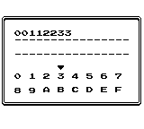
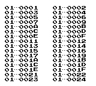

このプログラムは、ゲームROM内の特定のアドレスに存在する数値の羅列を検索し、その位置を特定するためのツールです。特定のデータやコードを探すのに役立ちます。

## プログラム概要

本プログラムは、ゲームROM内に存在する特定の16進数データを検索し、そのデータが格納されているバンクとアドレスを表示します。最大16バイト（32文字の16進数）までの連続した数値の羅列を検索することが可能です。

## 操作方法

### 入力画面

  
検索する数値を入力する画面です。最大16バイトまで入力できます。

| 操作         | 機能                                                          |
| :----------- | :------------------------------------------------------------ |
| 十字キー     | カーソルの移動                                                |
| Aボタン      | 文字の入力                                                    |
| Bボタン      | 1文字削除（何も入力されていない場合はプログラムを終了します） |
| SELECTボタン | 検索の開始                                                    |

### 検索結果表示画面

  
検索結果が表示される画面です。

| 操作    | 機能             |
| :------ | :--------------- |
| ↓ボタン | 次のページへ移動 |
| Bボタン | 入力画面へ戻る   |

## 検索結果について

検索結果は、検出された数値の羅列のバンクとアドレスが表示されます。1画面につき最大32個の結果が表示され、表示しきれない場合は次のページに移動して確認できます。検索が完了すると効果音が鳴り、完了までにおよそ30秒程度の時間を要します。

## 注意事項

検索を行う際には、入力する数値の文字数が必ず偶数になるようにご注意ください。奇数の文字数では検索が正しく実行されません。
