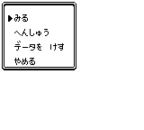
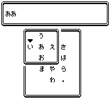

<iframe style="width: 100%; aspect-ratio: 16 / 9;" src="https://www.youtube.com/embed/uQeqB2pa6Jo?si=he19P9mJ6BzqYxWF" title="YouTube video player" frameborder="0" allow="accelerometer; autoplay; clipboard-write; encrypted-media; gyroscope; picture-in-picture; web-share" referrerpolicy="strict-origin-when-cross-origin" allowfullscreen></iframe>

## 準備

本プログラムはコードの規模が大きいため、「本体」と「キーボード」の2つのプログラムで構成されています。これらをそれぞれ別のボックスに書き込んでから使用してください。

## 導入方法

1.  本体とキーボードのコードを、それぞれ異なるボックスに記述する
2.  本体のコードを記述したボックスのアドレス「DA00」から実行を開始する
3.  編集時にボックス入れ替え画面が表示されたら、キーボード側のボックスへ切り替える

## メニュー項目

  

「へんしゅう」を選択した際、なまえ・しゅぞく・せつめいの編集にはキーボード側のプログラムが必要です。

| 項目           | 説明                                                                                 |
| :------------- | :----------------------------------------------------------------------------------- |
| みる           | 現在作成されている図鑑データを表示します。                                           |
| へんしゅう     | なまえ、しゅぞく、せつめい、グラフィック、たかさ、おもさ、ナンバーを編集します。     |
| データを　けす | 作成したデータを削除します。選択した瞬間に消去されるため、操作には注意してください。 |
| やめる         | プログラムを終了します。                                                             |

## キーボードの操作方法

  

スマートフォンのフリック入力に似た操作体系を採用しています。Aボタンを押し続けている間に行の候補が表示され、十字キーで選択後にAボタンを離すと入力が確定します。
入力が終了すると再度ボックスの切り替え画面が表示されるので、本体のコードが記述されているボックスに切り替えてください。

| キー               | 動作内容                                             |
| :----------------- | :--------------------------------------------------- |
| Aボタン（長押し）  | 入力したい行（あかさたな等）を選択状態にする         |
| Aボタン（離す）    | 選択中の文字を入力する                               |
| 十字キー：左       | 「い」段の文字を選択                                 |
| 十字キー：上       | 「う」段の文字を選択                                 |
| 十字キー：右       | 「え」段の文字を選択                                 |
| 十字キー：下       | 「お」段の文字を選択                                 |
| 十字キー：斜め方向 | スペースを入力する                                   |
| Bボタン            | 1文字戻る（削除）                                    |
| SELECT             | 文字種切り替え（ひらがな、カタカナ、数字・記号の順） |
| START              | テキスト入力を完了する                               |

## 注意事項

- 小文字や濁点への変換は、画面左下にある「こ」のキーから行います。
- 「データを　けす」を選択すると確認なしで即座にデータが消去されるため、慎重に操作してください。
